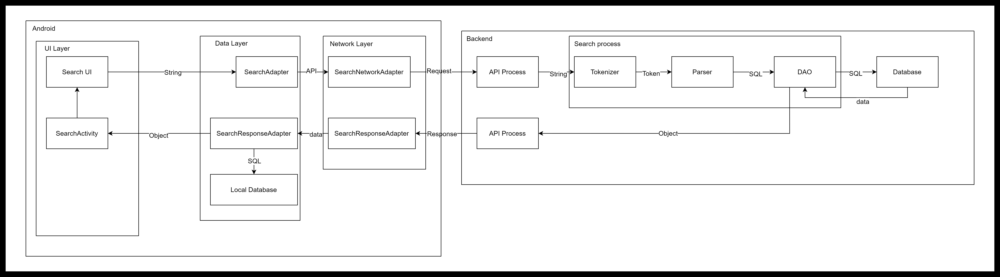

# Instructions
- One member of your group should `fork` this repository, add all the members to the repository and set it as private.
  > The forked repository will be where you continuously update your progress, and
  submit the major part of the project to.
  Include the link to your repository in group registration on Wattle.
- Some template files are provided in the `items` [folder](./items). Please place all your documents including report, meeting minutes, your APK, etc. in this folder, while
- your Android project should be in another folder with proper folder structures and naming.

Please refer to the `assignment specification` for detailed instructions.
- you are encouraged to update [report.md](./items/report.md) incrementally as the project progress. 
- You may also use [checklist.md](./items/checklist.md) for a Quick check.
- You must ensure the link to your repo is correct on the `Wattle Group Registration Page`.

# Sample process of functions

## Search function as an example

# Change Log

## 2024.04.22

---

### Han Bao

- Drafted structures for data layer

  More details are in the [README.md](./gp/app/src/main/java/com/example/gp/data/README.md) in the data package.

---

## 2024.04.21

---

### Han Bao

- New Main Activity

  Now New main activity has following logics:
  - Check if user already signed in
    - If not active original main activity (may change it to sign in activity?)
    - else remain in this activity

- Create Account Activity

  Now click create account button in original main activity actives sign up activity

---

## 2024.04.18

---

### Yulong Chen

- Add environment and dependency
- Add login activity

---

## 2024.04.15

---

### Zehua Kong

- Add structures: 
  - Data Item
  - Database management: SQLite Database
  - B-Tree structure for data storage

---

# TODO

- Come up a TODO list for the whole project and assign specific tasks to team members.
- More detail about back-end implementations

# Notice
## Third-party usage
- Amazon AWS
  - root user: Han
    - If you need access to AWS please feel free to contact me!
    - How to use AWS within jetBrain products: [Doc](https://docs.aws.amazon.com/toolkit-for-jetbrains/latest/userguide/welcome.html)
    - How to set up AWS environment: [Doc](https://aws.amazon.com/getting-started/guides/setup-environment/?ref=gsrchandson)
  - cognito: for sign up and sign in

- Material 3
  - Enrached UI

# Questions

- Can we use LiveData? or we need to implement our own Observer base class?

- Can we use interface to simulate the network API or we need to implement some network policies to prevent lose marks?